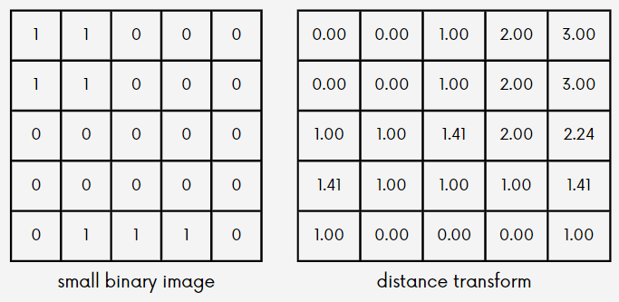

# Image Segmentation

*Elective 3 (Lab) - Image Processing*

**Group 3**
- Alexander Ryan Velasco
- Angelo Rubas
- 
- 
- 
- Helen Claire Villar
- Josias Seymour Morales
- Kelvin Edelson Perez
- Micha Lene Paclian
- Miraiza Elisa Merculio
- 
  
Professor: **Engr. Perferinda P. Caubang**

August 2, 2023

## Table of Contents
- [Image Segmentation](#image-segmentation)
  - [Table of Contents](#table-of-contents)
  - [What is Image Segmentation?](#what-is-image-segmentation)
  - [Point, Line, and Edge Detection](#point-line-and-edge-detection)
    - [Point Detection](#point-detection)
    - [Line Detection](#line-detection)
    - [Edge Detection](#edge-detection)
    - [Line Detection Using Hough Transform](#line-detection-using-hough-transform)
  - [Thresholding](#thresholding)
  - [Region Based Segmentation](#region-based-segmentation)
    - [Region Splitting](#region-splitting)
    - [Region Merging](#region-merging)
  - [Watershed Transform](#watershed-transform)

## What is Image Segmentation?

Image segmentation is a fundamental task in image processing and computer vision. It refers to the process of **dividing an image** into multiple distinct regions or segments, where each segment represents a meaningful object or region of interest within the image. The main goal of image segmentation is to simplify the representation of an image into more meaningful and understandable parts, which can be further analyzed or processed independently.

The process of image segmentation can be applied to various types of images, including photographs, medical images, satellite images, and more. It plays a crucial role in many computer vision applications, such as object recognition, object tracking, image editing, and scene understanding.

## Point, Line, and Edge Detection
Point, line, and edge detection are techniques in image processing and computer vision. They are used to identify specific features in an image, such as points (single pixels), lines, and edges (boundaries between regions with different intensity or color).

### Point Detection

Point detection is a fundamental concept in computer vision that involves identifying specific points or features within an image. 

These points are often referred to as keypoints, interest points, or corners, and they represent areas of the image that are distinctive or unique in some way.

### Line Detection

Line detection is the process of finding the straight lines in an image. It is an important step in image processing and computer vision. It is used in various applications such as lane detection in self-driving cars, OCR (Optical Character Recognition), and edge detection.

There are many algorithms available for line detection, but in this blog post, we will focus on the Hough Transform algorithm, which is widely used and easy to implement using OpenCV and Python.

### Edge Detection

An edge is a set of connected pixels that lies on the boundary between two region which differ in grey value. Pixels on edge is known as edge points.

Edges provide an outline of the object.

It locates sharp changes in the intensity function.

Edges are pixels where brightness changes abruptly.

### Line Detection Using Hough Transform

A computer vision technique for identifying straight lines in an image is called line detection using the Hough Transform. 

The concept entails representing each pixel of the image as a point in a parameter space representation, with lines acting as the image's other primary objects. 

## Thresholding

A fundamental image processing technique that converts a grayscale image into a binary image by separating objects or regions from the background. 

This is achieved by classifying pixels into two categories based on a threshold value: foreground (object) pixels and background pixels.

1. **Grayscale Image**: Thresholding is typically applied to grayscale images. If the input image is in color, it is first converted into grayscale.
2. **Choosing a Threshold Value**: selecting an appropriate threshold value.
3. **Binary Image Creation**: After selecting the threshold value, each pixel in the grayscale image is compared to the threshold.

## Region Based Segmentation
There are four primary sub-topics under region-based segmentation, these are: region growing, region splitting, region merging, and region labeling.

### Region Splitting
Entire image is assumed as a single region. Then the homogeneity(similarity) test is applied, where pixels that are similar are grouped together. If the conditions are not met, then the regions are split into four quadrants, or else leave the region as it is.

### Region Merging
Unlike region splitting - region merging is the opposite of region splitting. Here we start from the pixel level and consider each of them as a homogeneous region. At any level of merging, we check if the four adjacent regions satisfy the homogeneity property. If yes, they are merged to form a bigger region, otherwise the regions are left as they are. This is repeated until no further region exits that requires merging. 

This is the combination of the two topics that we discussed, this is simply the process of applying splitting and merging into one whole image. Following the same rules and guidelines as the previous topics, just combined into one image.

## Watershed Transform

Watershed image segmentation is a popular technique in digital image processing that aims to partition an image into distinct regions or objects based on the concept of watershed transformation from hydrology. It treats the image as a topographic landscape, with pixel intensity values representing elevation. Local minima are identified as "basins," and a flooding process is initiated, gradually filling each basin with water until their boundaries merge. The merging points represent regional boundaries, resulting in a segmentation map with each object or region labeled uniquely. Despite its utility in object detection and medical image analysis, watershed segmentation can be sensitive to noise and over-segmentation, often requiring additional post-processing for result refinement.

This is the combination of the two topics that we discussed, this is simply the process of applying splitting and merging into one whole image. Following the same rules and guidelines as the previous topics, just combined into one image.

**Distance Transform**: a tool commonly used with the watershed transform for segmentation.

For further information, please refer to the following links:
- 

